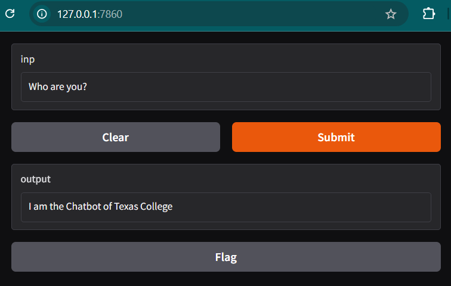
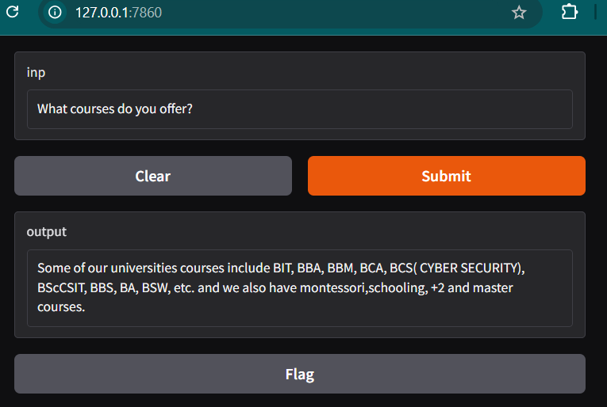

# Texas-College-Chatbot

Welcome to the Texas College Chatbot project! This chatbot is designed to assist students with various queries related to college life, courses, admissions, and more. The chatbot utilizes natural language processing (NLP) techniques to provide accurate and helpful responses.

## Features

- Interactive chat interface
- Quick responses to student inquiries
- Easy to extend with additional intents and responses

## Output Screenshots

Here are some screenshots of the chatbot in action:

### Output 1

*Description: This screenshot shows the chatbot responding to the question, "Who are you?" The chatbot introduces itself.*

### Output 2

*Description: In this output, the chatbot responds to the question, "Where are you located?" It provides details about the college's location.*

### Output 3

*Description: This screenshot depicts the chatbot's interaction with a student asking, "What courses do you offer?" The chatbot lists the various courses available at the college along with a brief description of each course.*
